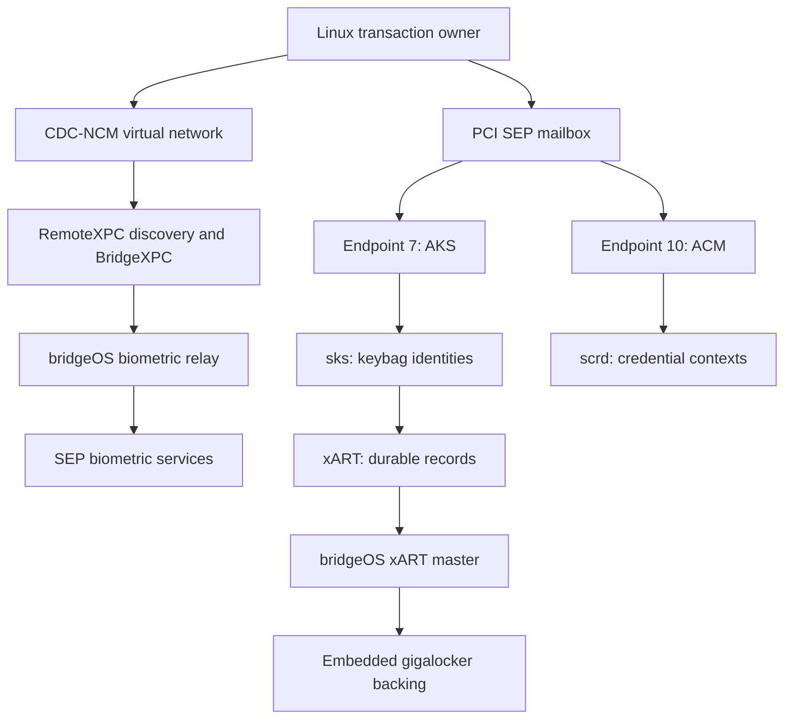

# SEP architecture

T2 Touch ID spans two host transports and several services inside the Secure
Enclave. Linux creates account authority through AppleKeyStore (AKS) and Apple
Credential Manager (ACM). Biometric requests travel through bridgeOS to the SEP.
Both paths participate in enrollment and matching.

This map follows the interfaces used by the proof of concept. It is not a complete
inventory of SEPOS applications. The artifact identities are in
[Artifacts and method](artifacts-and-method.md).

## Host routes and internal services

The Intel host's SEP PCI device is `106b:1802`; the mailbox is in BAR4.
Host endpoint 7 carries AKS and endpoint 10 carries ACM. Inside the matched SEP
firmware, the ARMv7 `sks` application identifies itself as `AppleKeyStore_SEP`
and registers an internal endpoint `0x12`. That internal registration is distinct
from the host's endpoint 7.

`scrd` manages credential contexts. `sks` manages keybag identities and uses
`xART` for durable records. Calls between these applications pass through
`libShared_t8012`. A recovered import name alone does not identify the receiving
service: several aliases reach the same generic send/receive routines, with the
service handle selecting the queue.

That distinction resolved a substantial false lead. Raw Intel endpoint-16
command 8 reached the `AMDM` control loop, whose accepted commands are 2–4.
The bridgeOS-internal `xars` queue accepts command 8 for OS identity publication.
They share transport machinery but have different dispatchers. See the
[routing experiment](boot-and-storage.md#why-host-endpoint-16-command-8-failed).

## Mailbox and out-of-line data

The AKS path uses separate page-aligned 16 KiB send and receive DMA buffers with
a 44-bit coherent DMA mask. Endpoint-0 control operations 2 and 3 register the
buffers using 12-byte messages containing the destination endpoint, page address,
and size. A registration outlives an individual request. The research driver
kept registered buffers alive until reboot because it had no proven unregister
sequence.

The Intel mailbox payload is 12 bytes. The send path replaces byte 0 with the
endpoint and preserves bytes 1–11. The fourth MMIO word carries sideband state;
it is not a fourth application payload word. Capturing all four words helped
separate application replies from transport metadata.

AKS requests have a four-byte size prefix followed by a versioned envelope and
an operation body. Envelope v1 is `0x48` bytes; v2 is `0x50` bytes. The integrity
field contains the first 16 bytes of SHA-256 over the envelope beginning at
offset `0x10` through the end of the body. Capability operation `0x4d` is sent
with v1 framing first; a successful response selects the supported version,
capped at v2 by this implementation.

A live transaction binds its session, message tag, buffers, and returned handle.
A timeout leaves the operation's outcome unknown. In particular, replaying
creation after a timeout can create uncertainty about which identity the host
owns. The creation/export sequence therefore keeps one transport owner until
the saved object is durable.

## Biometric transport

The CDC-NCM interface provides a virtual network connection to bridgeOS.
RemoteXPC discovery supplies the BiometricKit service port dynamically; the
research used BridgeXPC version 39. bridgeOS `bkremoted` relays the biometric
wire traffic. The Linux transaction owner constructs the host Catacomb archives
and retains them between boots.

Opening a biometric connection does not establish AKS readiness or xART backing
availability. These services have separate startup and state transitions. An
enrollment can also require a fresh Bridge connection while the AKS/ACM authority
remains live, as observed when finalizing the second fingerprint.

## Status handling

AKS operation failure is a signed status in the mailbox reply, separate from the
operation body's fields. In the Linux ioctl path, a direct libc call preserved
the kernel-mutated status on `EREMOTEIO`; a Python staging wrapper had hidden it.
Transport failure, malformed response, and a definite SEP rejection consequently
need separate results in an adapter.

Status values also depend on the receiving service. Endpoint-16 status `0x2d`
was an unsupported command in the `AMDM` dispatcher. Treating it as a filesystem
errno sent the investigation into the wrong subsystem.
